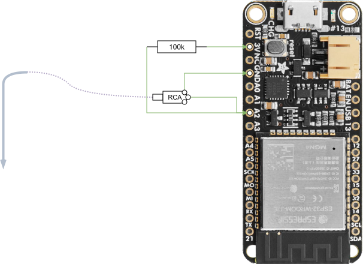
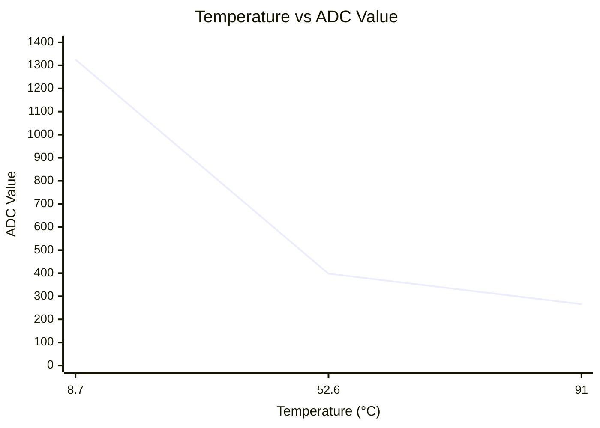
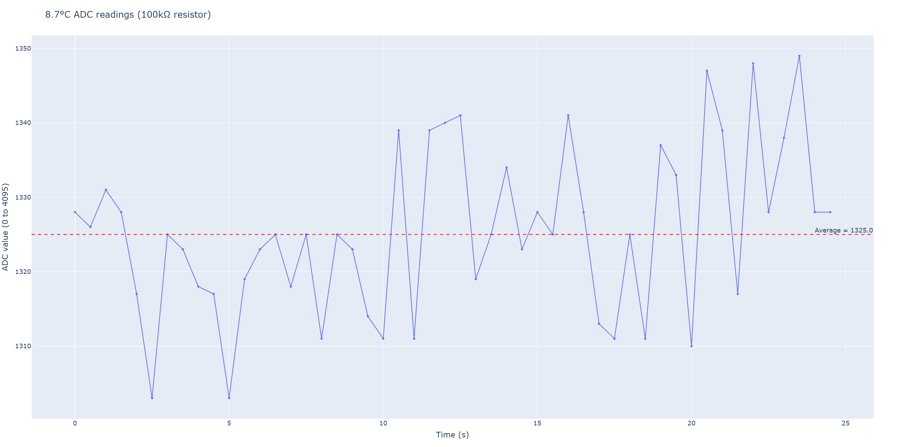
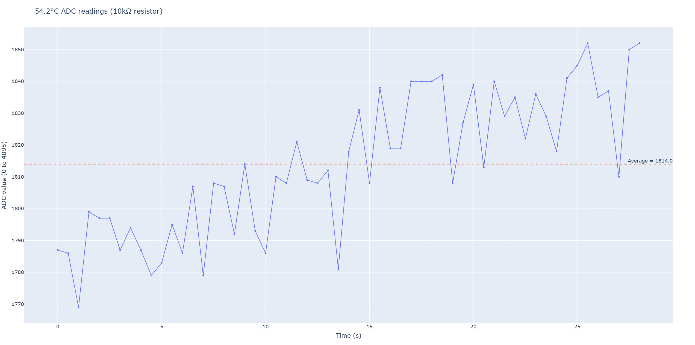
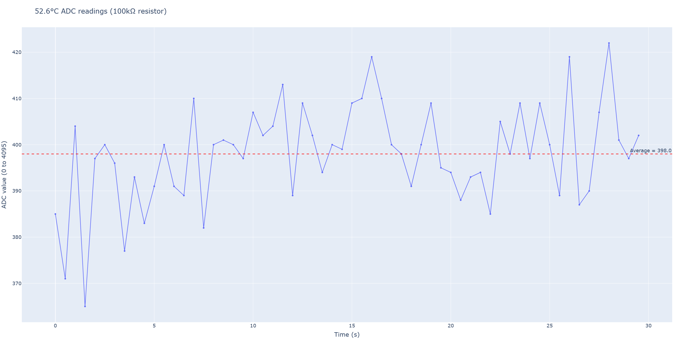
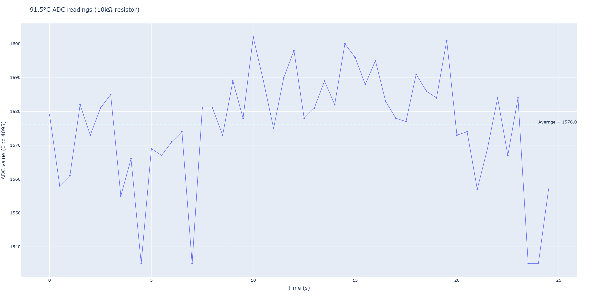
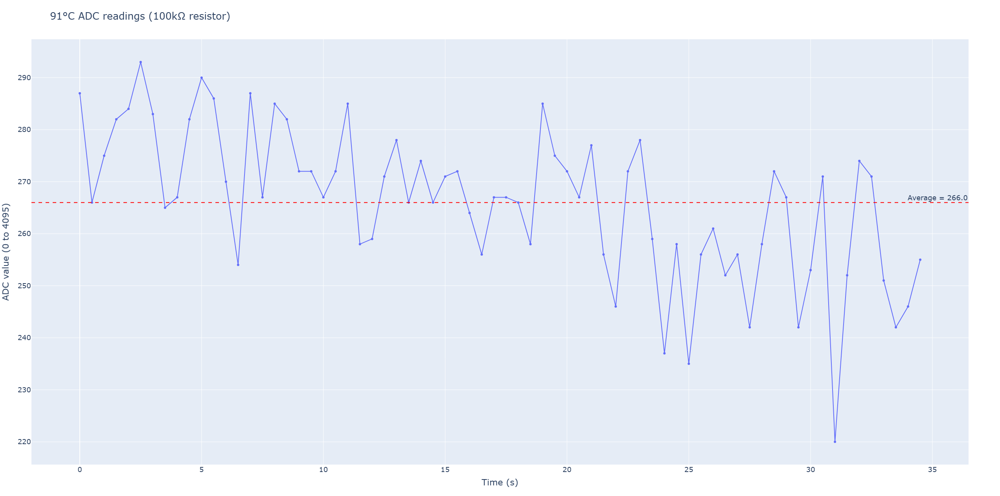

# Meat Thermometer Project

- [1. Description](#1-description)
- [2. Hardware](#2-hardware)
  - [2.1. Temperature Probe](#21-temperature-probe)
- [3. Software Setup](#3-software-setup)
  - [3.1. Debug](#31-debug)
  - [3.2. Monitor device](#32-monitor-device)
- [4. Building the meat thermometer](#4-building-the-meat-thermometer)
  - [4.1. Lingo](#41-lingo)
  - [4.2. Wiring diagram](#42-wiring-diagram)
    - [4.2.1. ESP32 Pins used](#421-esp32-pins-used)
  - [4.3. ADC measurements for Steinhart-hart coefficients](#43-adc-measurements-for-steinhart-hart-coefficients)
    - [4.3.1. Temperature 1 - 8.7℃ (100kΩ resistor)](#431-temperature-1---87-100kω-resistor)
    - [Temperature 2 - 54.2℃ (10kΩ resistor)](#temperature-2---542-10kω-resistor)
    - [Temperature 2 - 52.6℃ (100kΩ resistor)](#temperature-2---526-100kω-resistor)
    - [Temperature 3 - 91.5℃ (10kΩ resistor)](#temperature-3---915-10kω-resistor)
    - [Temperature 3 - 91℃ (100kΩ resistor)](#temperature-3---91-100kω-resistor)
  - [4.4. Reading temperature from probe](#44-reading-temperature-from-probe)
    - [4.4.1. Voltage divider at pin A2](#441-voltage-divider-at-pin-a2)
    - [4.4.2. ADC integer to voltage to resistance](#442-adc-integer-to-voltage-to-resistance)
    - [4.4.3. Converting resistance to temperature](#443-converting-resistance-to-temperature)

## 1. Description

## 2. Hardware

- [Adafruit HUZZAH32 ESP32 Feather](https://learn.adafruit.com/adafruit-huzzah32-esp32-feather)
- [0.96" LCD OLED 128x64px monterad på kort SPI/I2C](https://www.waveshare.com/wiki/0.96inch_OLED_(B))
- Scrapped Temperature Probe

### 2.1. Temperature Probe

The temperature probe is an NTC (Negative Temperature Coefficient) Thermistor. The resistance goes down as temperature goes up. At room temperature the thermistor is approximately 20kΩ.


## 3. Software Setup

Development in VS Code with [PlatformIO IDE](https://marketplace.visualstudio.com/items?itemName=platformio.platformio-ide) extension.

### 3.1. Debug

On Windows, you probably need drivers for the chip to be recognized: <https://www.silabs.com/software-and-tools/usb-to-uart-bridge-vcp-drivers?tab=downloads> (get the *CP210x Windows Universal Drivers*). Actually i first installed the *CP210x Windows Drivers*, then downloaded and extracted the *CP210x Universal Windows Driver*, then open Device Manager, right click Silicon Labs CP210x, go to Driver, click Update Driver and point to the extracted folder for the universal drivers. Without the universal drivers i would get the following error when uploading:

```
Auto-detected: COM3
Uploading .pio\build\featheresp32\firmware.bin
esptool.py v4.11.0
Serial port COM3
Connecting......................................

A fatal error occurred: Failed to connect to ESP32: Wrong boot mode detected (0x13)! The chip needs to be in download mode.
For troubleshooting steps visit: https://docs.espressif.com/projects/esptool/en/latest/troubleshooting.html
*** [upload] Error 2
```

### 3.2. Monitor device

We can capture device output (f.ex. from `Serial.println()`) by running `pio device monitor -f log2file`

## 4. Building the meat thermometer

### 4.1. Lingo

- ADC: Analog / Digital Converter (Is used when `analogRead()` is called)

### 4.2. Wiring diagram



#### 4.2.1. ESP32 Pins used

| Pin | Label | Used for                          |
| --- | ----- | --------------------------------- |
| 3V  | 3V    | Power to display VCC              |
| GND | GND   | Ground for display and thermistor |
| 18  | MO    | Display DIN (SPI data)            |
| 5   | SCK   | Display CLK (SPI clock)           |
| 27  | 27    | Display D/C                       |
| 15  | 15    | Display RES                       |
| 33  | 33    | Display CS                        |
| 34  | A2    | Thermistor analog input           |

### 4.3. ADC measurements for Steinhart-hart coefficients

To calculate the three Steinhart-hart coefficients needed to accurately estimate temperature from an NTC thermistor, we need to mesure the ADC value of the temperature probe at three different temperatures differentiating by at least 10℃.

**Resistor:** 100kΩ

| Temperature (°C) | ADC Value |
|------------------|-----------|
| 8.7              | 1325      |
| 52.6             | 398       |
| 91               | 266       |



**NOW WE CAN USE ALGORITHM TO PLOT EXACT TEMPERATURES FOR VALUE!!**

**Resistor:** 10kΩ

| Temperature (°C) | ADC Value |
|------------------|-----------|
| ~8               | ?         |
| 52.2             | 1814      |
| 91.5             | 1576      |

#### 4.3.1. Temperature 1 - 8.7℃ (100kΩ resistor)

The average ADC reading is 1325 for a temperature of 8.7℃ over 25 seconds using a 100kΩ resistor.



#### Temperature 2 - 54.2℃ (10kΩ resistor)

The average ADC reading is 1814 for a temperature of 54.2℃ over ~25 seconds using a 10kΩ resistor.



#### Temperature 2 - 52.6℃ (100kΩ resistor)

The average ADC reading is **398** for a temperature of **52.6℃** over ~30 seconds using a **100kΩ resistor**.



#### Temperature 3 - 91.5℃ (10kΩ resistor)

The average ADC reading is 1576 for a temperature of 91℃ over ~25 seconds using a 10kΩ resistor.



#### Temperature 3 - 91℃ (100kΩ resistor)

The average ADC reading is 266 for a temperature of 91℃ over ~35 seconds using a 100kΩ resistor.



### 4.4. Reading temperature from probe

#### 4.4.1. Voltage divider at pin A2

The voltage divider created at A2 will measure a voltage $V_{out}$ according to the formula:

$$
V_{out} = V_{in} \frac{R_2}{R_{1}R_{2}}
$$

where $V_{in}$ is our input voltage (3.3V), $R_1$ is the fixed resistor (lets refer to it as $R_{fixed}$) and $R_2$ is the voltage from our thermistor (lets refer to it as $R_{therm}$).

#### 4.4.2. ADC integer to voltage to resistance

In order to estimate a temperature from the probe, we need to calculate the resistance. This is not known by the program, but the digital integer value is, so we have to work backwards:

$$
R_{therm} = R_{fixed}\frac{V_{out}}{V_{in}-V_{out}}
$$

But since we are working with digital values, $V_{in}$, being 3.3V is equivalent to the highest digital value of 4095, lets call it $ADC_{max}$ and we get $V_{out}$ from reading the pin using `analogRead(THERM_PIN)`, let's call it $ADC_{therm}$.

$$
R_{therm} = R_{fixed}\frac{ADC_{therm}}{ADC_{max}-ADC_{therm}}
$$

Or if we solve for $ADC_{therm}$:

$$
ADC_{therm} = R_{therm}\frac{ADC_{max}}{R_{fixed}+R_{therm}}
$$


#### 4.4.3. Converting resistance to temperature

The Steinhart and Hart Equation is an empirical expression that has been determined to be the best mathematical expression for resistance temperature relationship of NTC thermistors and NTC probe assemblies.

The common equation is as follows:

$$
T = \frac{1}{A + B\ln(R) + C(\ln(R))^3}
$$

where $T$ is the temperature (in kelvins), $R$ is the resistance at $T$ (in ohms), $A$, $B$ and $C$ are the Steinhart–Hart coefficients, derived as follows:

First, measure the thermistor at three different temperatures ($T_1$, $T_2$ and $T_3$). The temperatures should be evenly spaced and at least 10 degrees apart. Use the three temperatures to solve three simultaneous equations:

$$
\frac{1}{T_1} = A + B\ln(R_1) + C(\ln(R_1))^3
$$
$$
\frac{1}{T_2} = A + B\ln(R_2) + C(\ln(R_2))^3
$$
$$
\frac{1}{T_3} = A + B\ln(R_3) + C(\ln(R_3 ))^3
$$
